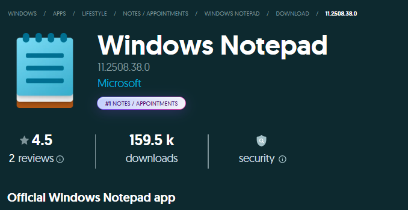
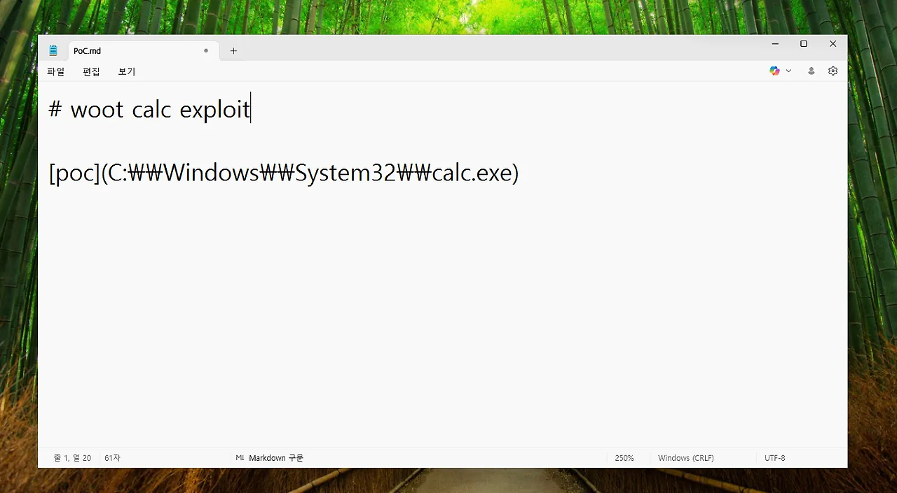
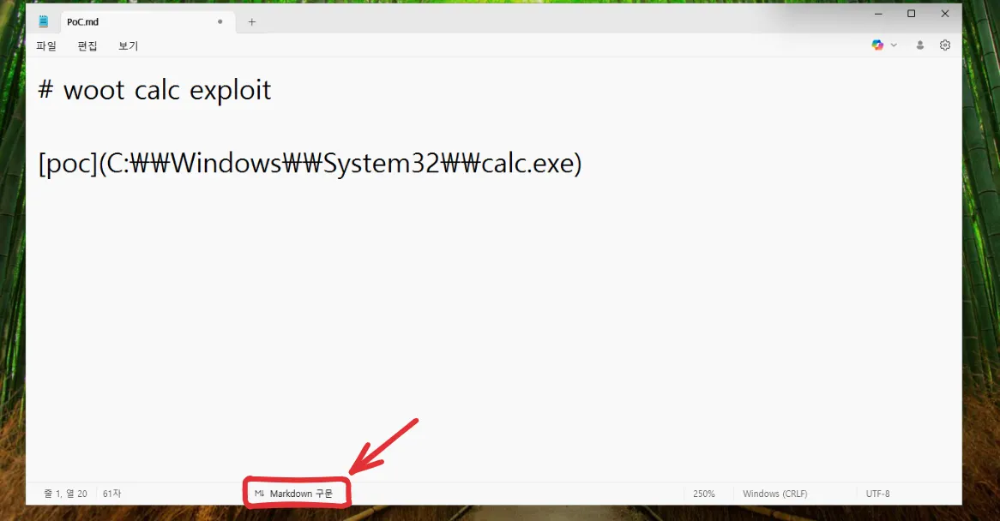
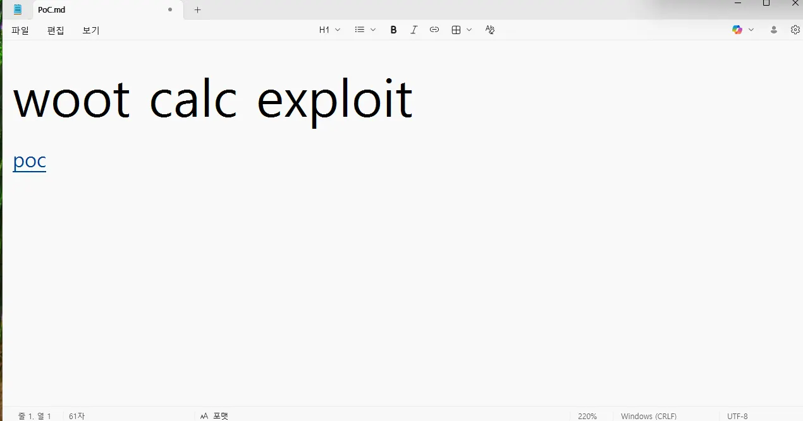
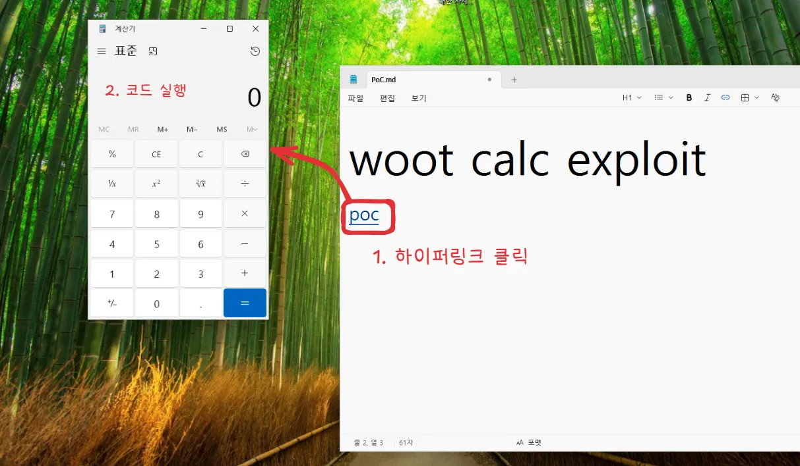

[https://windowsforum.com/threads/cve-2026-20841-notepad-rce-msrc-confidence-and-urgent-patch-guide.400819/](https://windowsforum.com/threads/cve-2026-20841-notepad-rce-msrc-confidence-and-urgent-patch-guide.400819/)

 [CVE-2026-20841 Notepad RCE: MSRC Confidence and Urgent Patch Guide

Microsoft’s Security Update Guide has recorded CVE-2026-20841 as a Remote Code Execution (RCE) vulnerability affecting the Windows Notepad app, and the vendor’s terse advisory combined with its “report confidence” metadata demands immediate, measur

windowsforum.com](https://windowsforum.com/threads/cve-2026-20841-notepad-rce-msrc-confidence-and-urgent-patch-guide.400819/)

이번에는 윈도우 메모장에서 나온 CVE-2026-20841에 대해 알아보겠습니다.

## 요약 설명

Windows 메모장이 Markdown 하이퍼링크와 신뢰할 수 없는 프로토콜 처리기를 처리하는 방식을 남용하여 RCE(원격 코드 실행)를 활성화 합니다. 사용자가 악성 .md 파일을 열고 링크를 클릭하도록 유도함으로써 공격자는 로그인한 사용자의 권한으로 임의 명령을 실행할 수 있습니다.

## CWE

-   CWE-77: CWE-77: 명령에 사용된 특수 요소의 부적절한 무력화(’명령 주입’)

## CVSS

-   Score : 8.8
-   Severity : HIGH 높음

## 영향을 받는 버전

-   11.2510 미만 버전

## 분석

윈도우의 메모장은 단순 텍스트 편집기에서 Markdown 렌더링을 포함한 다양한 기능을 포함하도록 발전하였습니다. CVE-2026-20841는 이 렌더링 엔진 내의 명령 주입 결함으로 발생 합니다.

메모장이 특별히 제작된 Markdown 하이퍼링크를 처리할 때 취약점이 발생합니다. 에플리케이션이 링크와 연결된 프로토콜 핸들러의 유효성을 제대로 검사하지 못하여 발생한 이 결함으로 인해 웹 URL을 여는 것이 아닌 원격으로 파일이나 로컬 시스템 명령을 검색하고 실행할 수 있는 검증되지 않은 프로토콜 처리기를 호출할 수 있습니다.

### 주요 기술 세부정보 :

-   Vertor : Network / User Interaction Required
-   Exploitation : 공격자는 피싱이나 다운로드를 통해 .md 파일을 전달합니다. 사용자가 메모장 미리 보기 또는 인터페이스 내에서 악성 링크를 클릭하면 프로토콜 처리기가 트리거 됩니다.
-   Imact : 코드 실행은 피해자의 보안 컨텍스트에서 발생 합니다. 피자에게 관리자 권한이 있는 경우 전체 시스템 탈취가 가능 합니다.
-   Ubiquity : 메모장은 Windows의 핵심 구성 요소이므로 이 취약점의 공격 표면은 사실상 모든 최신 Windows 워크스테이션 입니다. (현재는 패치 됨)

## 재현

환경 : 윈도우 11 home

메모장 버전 : 11.2508.38.0 (취약한 버전을 받아서 진행)

\- 독립된 VM 환경에서 진행하였습니다.

PoC 예시 : [https://github.com/BTtea/CVE-2026-20841-PoC](https://github.com/BTtea/CVE-2026-20841-PoC)

 [GitHub - BTtea/CVE-2026-20841-PoC: PoC

PoC. Contribute to BTtea/CVE-2026-20841-PoC development by creating an account on GitHub.

github.com](https://github.com/BTtea/CVE-2026-20841-PoC)

### 악성 마크 다운 작성

-   마크 다운 문법을 활용하여 실행 시키고자 하는 프로그램의 주소를 하이퍼링크로 걸어줍니다.

-   이후 하단의 Markdown 구문 버튼을 눌러 마크 다운 형태로 변경해줍니다.

### PoC 실행

-   마크 다운으로 변경하고 하이퍼 링크를 실행 시키기 위해 ctrl + 클릭을 하게 되면

-   주소로 걸어두었던 계산기를 실행 시킬 수 있습니다.

## 소감

이런 식으로도 쉽게 뭔가 취약점을 발견하고 RCE까지 가능한 것을 보고 재현해보고 정말 무언가를 바라보는 관점이 다양하고 창의적으로 생각해야 이런 취약점을 찾을 수 있겠구나 ‘나도 좀 더 다양한 시각으로 또는 창의적인 접근을 하는 연습(?)을 해봐야겠다.’ 라는 생각이 드는 1-day 였습니다.