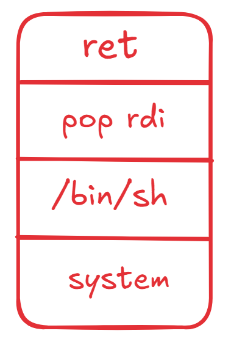

# ROP payload 이해

- 해당 페이지에서는 내가 쫌 헷갈렸던 ROPpayload 개념에 대해 적어놓겠다

```jsx
pop rdi
/bin/sh
system
```

위와 같이 페이로드를 넣는다고 생각해보자 그렇다면 system(”/bin/sh”)가 실행되고 쉘을 얻을 수 있을 것이다.

- rdi에 /bin/sh를 넣는 이유는 system의 인자 규약이 system(rdi)이기 때문이다.

### 내가 자주 헷갈렸던 부분

```jsx
pop rdi

/bin/sh

system
```

payload를 순서대로 실행 시켜보자

- pop rdi → rsp의 값을 rdi에 넣는다
- /bin/sh
- system

궁금증!

- pop rdi가 먼저 실행되는데 어떻게 다음 오는 /bin/sh가 rdi안에 담길 수 있는가!

## 그 이유는!

스택 구조를 생각해보자



우리가 payload를 넣으면 다음과 같이 스택이 구성 될 것이다. (ret으로 시작하는 이유는 페이로드를 넣기 전 마지막이 ret으로 끝나기 때문에)

그럼 우선 ret에 대해 생각해보자 ret은 기본적으로 아래와 같은 동작을 한다.

```jsx
RIP = [rsp]
rsp += 8
```

즉, 다음 코드를 RIP(현지 실행 위치)로 가져옴과 동시에 rsp를 다음 실행할 위치로 옮긴다. 이 점을 유의 하면서 payload를 차례대로 봐보자

1. ret이 실행되는 순간 멈춘다고 생각해보자


- 위와 같이 rip가 ret을 가르키고 rsp는 다음 위치인 pop rdi를 가르키게 될 것이다.

1. 다음 pop rdi를 생각해보자 아마 우리는 가젯을 쓸 때 pop rdi ; ret을 사용할 것이다 그러니 스택 구조는 정확하게는 아래와 같다.


먼저 첫번째 pop rdi가 실행된다 기본적으로 pop [레지스터]는 rsp의 값을 레지스터에 넣고 rsp + 8을 하게된다.


pop rdi까지만 동작했을 때는 위와 같이 될 것이다. 이후 ret을 실행하면 ret은 rip의 값을 rsp로 옮긴 후 rsp+8을 시키니 다음과 같다.


- 즉 system(rdi)니 system(/bin/sh)가 실행되게 되는 것이다.